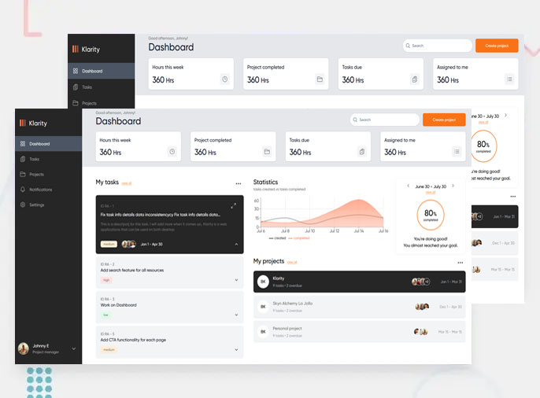

#  Klarity Issue Tracker

## Overview
Klarity is an issue tracker web application built with **MySQL**, **React**, **TypeScript**, **Node.js**, **Express**, and **Tailwind CSS**. It provides a platform for managing and tracking project issues, facilitating collaboration and organization within teams.

## Table of Contents
1. Features
2. Installation
3. Usage
4. Contributing
5. License

---

## Features 📋 

- **User Authentication**: Secure user authentication system allowing users to register, login, and manage their accounts.
- **Issue Management**: Create, view, update, and delete issues with details such as title, description, priority, status, and assignees.
- **Project Management**: Create, view, update, and delete projects with details such as title, description, members, and tasks.
- **Kanban Board**: Utilize a Kanban board for visualizing and managing project workflows.
- **Dashboard**: Personalized dashboard providing an overview of project activities, tasks, and notifications.
- **Search and Filtering**: Efficiently search for specific issues or projects using various filters.
- **Commenting System**: Engage in discussions by commenting on issues or projects, facilitating better communication among team members.
- **User Management**: Administer user roles, permissions, and access control settings.
- **Customization**: Tailwind CSS integration for easy customization of the user interface according to project requirements.
- **Responsive Design**: Mobile-friendly interface ensuring usability across different devices and screen sizes.
- **Task Calendar**: Integrated calendar for tracking project tasks and deadlines.
- **Attachments**: Add attachments to issues or projects for including relevant documents, images, or files.
- **Notifications**: Receive real-time notifications for updates, comments, and changes within the project.
- **Project Stats**: Access project statistics and analytics to track progress and performance.

---

## Installation ⚙️
1. **Clone Repository**: Clone this repository to your local machine using `git clone https://github.com/your-username/issue-tracker.git`.
2. **Install Dependencies**: Navigate to the project directory and install dependencies using `npm install`.
3. **Set Up Database**: Configure **MySQL** database settings in `config/database.js`.
4. **Start Server**: Start the server by running `npm run dev`.
5. **Access Application**: Access the application in your web browser at `http://localhost:3000`.

---

## Usage 📚 
1. **Register/Login**: Register for a new account or login with existing credentials.
2. **View Issues**: Explore existing issues on the dashboard, categorized by status and priority.
3. **Create Issue**: Click on the "New Issue" button to create a new issue, providing necessary details.
4. **Update/Delete Issue**: Edit or delete existing issues as needed.
5. **Search and Filter**: Utilize search and filtering options to find specific issues quickly.
6. **Comment on Issues**: Engage in discussions by commenting on issues, providing additional context or updates.
7. **Logout**: Logout from the application when finished.

---

## Contributing 🤝
Contributions are welcome! If you'd like to contribute to this project, please follow these steps:
1. Fork the repository.
2. Create your feature branch (`git checkout -b feature/your-feature`).
3. Commit your changes (`git commit -am 'Add some feature'`).
4. Push to the branch (`git push origin feature/your-feature`).
5. Create a new Pull Request.

---

## License 📝
This project is licensed under the [MIT License](https://mit-license.org/).
